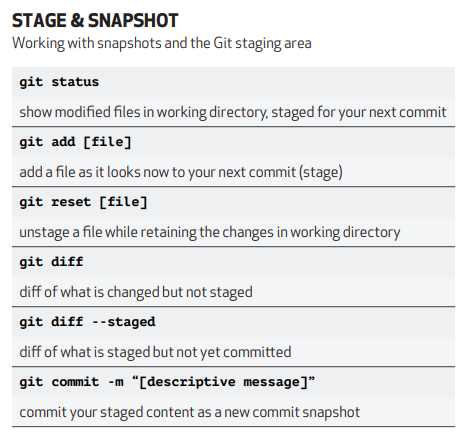

## Git Explained





### Branch Related

```
git branch -M main
```

- "git branch": This is the command used to manage branches in Git.
- "-M": This option stands for "move/rename". It's used to rename a branch.
- "main": This is the new name you want to give to the current branch.


### Push Related:

```
git push -u origin main
```
- "git push": This command is used to push your local commits to a remote repository.
- "-u": This option stands for "set upstream". It tells Git to associate the local branch with a remote branch so that you can use "git pull" without specifying the remote and branch name.
- "origin": This is the name of the remote repository where you want to push your changes. "origin" is a commonly used default name for the remote repository you cloned from.
- "main": This is the name of the branch you want to push your changes to.

    **Usage Summary:**

    Let's break down the concept of upstream in Git:

    When you clone a repository from a remote server, Git sets up a link between your local repository and the remote repository. This link is called the "upstream" repository. When you push changes to the remote repository, Git knows where to send those changes because of this upstream link.

    However, when you create a new branch locally and want to push it to the remote repository for the first time, Git doesn't automatically know which remote branch to associate it with. That's where the "-u" or "--set-upstream" flag comes in.

    By using "git push -u origin main", you're telling Git to push your local "main" branch to the remote repository named "origin" and set up an upstream link between your local "main" branch and the remote "main" branch. This means that in the future, if you're on your local "main" branch and you run "git pull" or "git push" without specifying the remote and branch name, Git will know that you want to pull from or push to the "main" branch on the "origin" remote repository.

    In summary, setting the upstream branch helps Git understand the default remote branch to interact with when you're working on your local branch. It's particularly useful for streamlining your workflow, especially when collaborating with others.